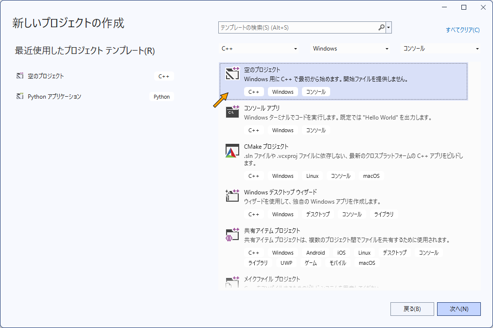

# particle

## 1. C++プロジェクトの新規作成

実験には何かの道具が必要になります。もし、それに使える既存のアプリケーションやサービス、あるいは、他の人が作ったプログラムやライブラリが存在すれば、それを使うに越したことはありません。しかし、実験の内容を満たす道具が無かったり、同じ目的の異なる手法を開発しようとするなら、ある程度道具は自分で作る必要があります。ここではプログラミングの練習も兼ねて、できるだけ何もないところから、目的のプログラムを作成することにします。

### 1.1 新しい C++ プロジェクトの作成

Visual Studio 2022 を起動して「新しいプロジェクトの作成(N)」を選びます。


「空のプロジェクト」を作成します。



### 1.2 main.cpp の追加

「プロジェクト」メニューから「新しい項目の追加(W)...」を選びます。


追加する項目のファイル名を指定します。ここでは main.cpp とします。


ソースプログラムを入力します。


ソースプログラムの内容は、次のようなものです。何もしないプログラムです。

```cpp
auto main() -> int
{
}
```

### 1.3 プログラムのビルドと実行

「▷ローカル Windows デバッガー」をクリックして、プログラムのビルドと実行を行います。


ビルドに成功するとプログラムが実行されて、次のようなコンソールウィンドウが現れます。このウィンドウ上で任意のキーをタイプするかクローズボックスをクリックして、ウィンドウを閉じます。


## [ステップ 01](https://github.com/tokoik/particle/blob/step01/README.md)

## 2. ライブラリの追加

OpenGL を使ったアプリケーションの作成を手助けするために、[GLFW](https://www.glfw.org/)、[GLEW](https://glew.sourceforge.net/)、[GLM](https://github.com/g-truc/glm) の 3 つのライブラリを作成したプロジェクトに追加します。これらは、それぞれの Web ページからソースファイルやコンパイル済みのバイナリファイルを入手することができますが、Visual Studio では [NuGet](https://www.nuget.org/) というパッケージマネージャを使って、作成したプロジェクトに組み込むことができます。

### 2.1 GLFW の追加

OpenGL はプラットフォームに依存しないグラフィックスライブラリですが、アプリケーションが OpenGL を使ってグラフィックス表示をしようとするときには、プラットフォームに依存した手順でお膳立てをしてやる必要があります。GLFW は、そのお膳立てをするためのレームワーク（ソフトウェア開発を手助けするための枠組み）です。これをインストールするために、まず「プロジェクト」メニューから「NuGetパッケージの管理(N)...」を選びます。


「参照」を選んで「glfw」を検索し、glfwのパッケージを選んで「インストール」をクリックします。


「適用」をクリックします。


### 2.2 GLEW の追加

同様にして、GLEW というライブラリをインストールします。これは Windows が標準ではサポートしていない OpenGL のバージョン 1.1 より後の機能を有効にします。「glew」を検索して最新版の2.2.0 を選び、「インストール」をクリックします。なお、前記の GLEW のプロジェクトのサイトでは最新版は 2.1.0 になっていますが、GitHub 上の最新版は 2.2.0 になっています (2025 年 5 月 23 日時点)。


### 2.3 GLM の追加

最後に、GLM をインストールします。これは OpenGL を使ってプログラミングする際に便利なデータ型や数学関数を集めたものです。「glm」を検索し、glmのパッケージを選んで「インストール」をクリックします。


NuGet のタブはもう使わないので閉じて構いません。


## [ステップ 02](https://github.com/tokoik/particle/blob/step02/README.md)

## 3. ウィンドウ関連の処理

ウィンドウの作成やマウス・キーボード入力などの処理には GLFW を使いますが、これらの処理をプログラムのあちこちに書くと、メインの処理が読みづらくなるので、Window というラッパークラスにまとめます。このあたりのことについては「GLFWによるOpenGL入門」を復習してください。

### 3.1 Window クラスの追加

「プロジェクト」メニューから「クラスの追加(C)...」を選びます。


「クラス(L)」名は「Window」にします。「.h ファイル」と 「.cpp ファイル」のファイル名はクラス名から自動的に設定されますが、ここでは「インライン(I)」にチェックを入れて、「.h ファイル」だけを作成します。


### 3.2 ヘッダファイルの追加

Windows.h に以下の内容を追加します。この最初で OpenGL 関連のヘッダファイルを `#include` します。OpenGL を使うときは GL/gl.h を`#include` するのが一般的でしたが、Windows が正式にサポートしている OpenGL のバージョンは 1.1 までで、それ以降の新しい機能はビデオカードのドライバが提供していても定義されていません。そのため、ここでは代わりに GL/glew.h を使います。

また、このプログラムでは Windows の機能を使う必要があるウィンドウの生成や管理、またキーボードやマウスなどによるイベントの処理などに GLFW を使いますので、GLFW/glfw3.h を#include します。なお、このヘッダファイルは内部で GL/gl.h を `#include` するので、GLEW を使う場合は、この前に GL/glew.h を `#include` する必要があります。

```cpp
#pragma once

// OpenGL 関連
#include <GL/glew.h>
#include <GLFW/glfw3.h>
```

このプログラムでは、OpenGL / GLSL に対応したデータ型を取り扱うことのできる数学関数ライブラリ [GLM](https://github.com/g-truc/glm) を使用します。そのヘッダファイルもここで `#include` します。なお、`_USE_MATH_DEFINES` は GLM と直接関係ありませんが、これを定義しないと Visual Studio では C 言語や C++ 言語でよく使われる `M_PI` などの数学定数が定義されません。また、GLM の以前のバージョンではデフォルトでは角度の単位が °(度) なので、`GLM_FORCE_RADIANS` を定義してラジアンに切り替えます。

```cpp
// GLM 関連
#if !defined(_USE_MATH_DEFINES)
#  define _USE_MATH_DEFINES
#endif
#if !defined(GLM_FORCE_RADIANS)
#  define GLM_FORCE_RADIANS
#endif
#include <GLM/glm.hpp>
```

### 3.3 Window クラスのプライベートメンバ

`Window` クラスのプライベートメンバには、ウィンドウを作成したときに作られるウィンドウの識別子 `window` と、ウィンドウのサイズ `size` を保持するようにします。`window` の内容は開いたウィンドウが破棄されるまで変化しないので `const` にしておきます。また `size` は投影変換行列を作る時などに頻繁に使われる画面の縦横比（アスペクト比）や、マウスカーソルのウィンドウ上での相対的な位置の算出に必要になるので、ウィンドウのサイズが変更されたときに算出して保持するようにします。`glm::dvec2` は数値の精度が `double` 型の 2 次元ベクトルのデータ型です。数値の精度が `float` 型の 2 次元ベクトルは `glm::vec2` です。

```cpp
///
/// ウィンドウ関連の処理クラス
///
class Window
{
  /// ウィンドウの識別子
  GLFWwindow* const window;

  /// ウィンドウのサイズ
  glm::dvec2 size;
```

### 3.4 ウィンドウサイズ変更時の処理

ウィンドウのサイズを変更したときに呼び出すメソッド `resize()` を定義します。このメソッドはコールバック関数として用いるので、`static` メソッドにする必要があります。しかし、`static` メソッドはインスタンスに属するメンバ変数の `window` や `size` を参照することはできません。このメソッドはサイズが変更されたウィンドウに対して呼び出されるので、対象のオブジェクト自体は存在します。

そこで後述するコンストラクタにおいて、ウィンドウのオブジェクトを生成したときに、その実体を指す `this` ポインタを GLFW のライブラリの方に保存しておきます。そして、`resize()` が呼び出されたときにライブラリから `this` ポインタを取り出し、それを介してオブジェクトのメンバ変数にアクセスします。

なお、`resize()` の引数の `width` と `height` には、ウィンドウのディスプレイ上の幅と高さが与えられますが、これらと OpenGL のフレームバッファのサイズは、必ずしも一致していません。近年の高密度のディスプレイを採用した PC の中には、画面上のサイズよりも高い解像度のフレームバッファをもつものがあり (macOS)、そのような PC で `width` と `height` を使ってビューポートを設定すると、ビューポートが開いたウィンドウより小さく設定されてしまいます。そのため、`glfwGetFramebufferSize()` を使って実際のフレームバッファのサイズを調べます。

```cpp
  ///
  /// ウィンドウのサイズ変更時の処理
  ///
  /// @param[in] window サイズ変更の対象のウィンドウの識別子
  /// @param[in] width サイズ変更後のウィンドウの幅
  /// @param[in] height サイズ変更後のウィンドウの高さ
  ///
  /// @note glfwSetWindowSizeCallback() で登録するコールバック関数
  ///
  static auto resize(GLFWwindow* window, int width, int height) -> void
  {
    // window が保持するインスタンスの this ポインタを得る
    const auto instance{ static_cast<Window*>(glfwGetWindowUserPointer(window)) };

    // インスタンスからの呼び出しでなければ戻る
    if (instance == nullptr) return;

    // インスタンスのウィンドウのサイズを更新する
    instance->size = { width, height };

    // フレームバッファの大きさ
    int fbWidth, fbHeight;

    // フレームバッファの大きさを得る
    glfwGetFramebufferSize(window, &fbWidth, &fbHeight);

    // フレームバッファ全体をビューポートにする
    glViewport(0, 0, fbWidth, fbHeight);
  }
```

### 3.5 コンストラクタ

メンバ変数の `window` と `size` はコンストラクタの初期化しリストで初期化します。`window` は `glfwCreateWindow()` で作成したウィンドウの識別子を保持します。`size` は作成したウィンドウのサイズで、これはコンストラクタ内で呼び出している `resize()` でも設定しますが、プライベートメンバは初期化しておくべきなので、作成したウィンドウの縦横比で初期化しておきます。

コピーコンストラクタは削除しておきます。`Window` クラスはメンバの `window` は、ディスプレイ上のウィンドウという「実際のオブジェクト」を示しています。したがって `Window` クラスに複数のインスタンスが存在すると、同じウィンドウに対して異なる状態を持たせることが可能になり、矛盾が生じます。また、デストラクタで `glfwDestroyWindow()` を呼び出してウィンドウを破棄するようにしていると、一つのインスタンスを破棄した後、残りのインスタンスを破棄する際に実際のオブジェクトであるウィンドウ」が存在しなくなるため、プログラムをクラッシュさせるようなエラーを引き起こしてしまいます。

これと同様に、インスタンスのコピーを禁止するために、代入演算子も削除しておきます。`Window` クラスのメンバの `window` は `const` にしているので、もとよりインスタンスに別のインスタンスを代入をすることができませんが、代入演算子を削除することによって、インスタンスのコピーの禁止を明確に示しておきます。

```cpp
public:

  ///
  /// コンストラクタ
  ///
  /// @param[in] width ウィンドウの幅
  /// @param[in] height ウィンドウの高さ
  /// @param[in] title ウィンドウのタイトル
  ///
  Window(int width = 640, int height = 480, const char* title = "GLFW Window") :

    // ウィンドウを生成して識別子を保存する
    window{ glfwCreateWindow(width, height, title, nullptr, nullptr) },

    // 開いたウィンドウのサイズを保存する
    size{ width, height }
  {
    // ウィンドウが開けなければ戻る
    if (window == nullptr) return;

    // 現在のウィンドウを処理対象にする
    glfwMakeContextCurrent(window);

    // 表示はディスプレイのリフレッシュレートに同期させる
    glfwSwapInterval(1);

    // このインスタンスの this ポインタを記録しておく
    glfwSetWindowUserPointer(window, this);

    // ウィンドウのサイズ変更時に呼び出す処理を登録する
    glfwSetWindowSizeCallback(window, resize);

    // 開いたウィンドウに初期設定を適用する
    resize(window, width, height);
  }

  // コピーコンストラクタは使用しない
  Window(const Window& window) = delete;

  // ムーブコンストラクタはデフォルトのものを使用する
  Window(Window&& window) = default;

  ///
  /// デストラクタ
  ///
  virtual ~Window()
  {
    // ウィンドウを破棄する
    glfwDestroyWindow(window);
  }

  // 代入演算子は使用しない
  Window& operator=(const Window& window) = delete;

  // ムーブ代入演算子はデフォルトのものを使用する
  Window& operator=(Window&& window) = default;
```

### 3.6 そのほかのメンバ関数

そのほかのメンバ関数を定義します。`get()` メソッドは、対象のウィンドウの識別子を取り出します。この戻り値が `nullptr` でないことを調べれば、ウィンドウが生成されたことを確認できます。

```cpp
  ///
  /// ウィンドウの識別子を取り出す
  ///
  /// @return ウィンドウの識別子
  ///
  auto get() const
  {
    // ウィンドウの識別子を返す
    return window;
  }
```

描画ループの継続判定を行うメソッドを定義します。これを `bool` をオーバーライドして定義することにより、インスタンスを `if ( ... )` や `while ( ... )` の `( ... )` の中などの論理コンテキストで評価したときに呼び出すことができます。

この中では、まず `glfwPollEvents()` によりマウスやキーボードの操作などにより発生したイベントを取り出し、その結果を `glfwWindowShouldClose()` により判定して、ウィンドウが閉じられた場合には、ループを継続しないとして `false` を返します。`glfwPollEvents()` や `glfwWaitEvents()` を使ってイベントの取り出しを行わないと、例えばウィンドウが閉じられたこと（これもイベント）を `glfwWindowShouldClose()` が検出できません。

```cpp
  ///
  /// 描画ループの継続判定
  ///
  /// @return 描画を継続する場合は true
  ///
  explicit operator bool() const
  {
    // イベントを取り出す
    glfwPollEvents();

    // ウィンドウを閉じないなら true を返す
    return glfwWindowShouldClose(window) == GLFW_FALSE;
  }
  ```

  処理対象のウィンドウ `window` に対する描画が完了した後に `glfwSwapBuffers()` を呼び出すメソッドを定義します。

```cpp
  ///
  /// ダブルバッファリング
  ///
  auto swapBuffers() const
  {
    // カラーバッファを入れ替える
    glfwSwapBuffers(window);
  }
```

そのほか、処理対象のウィンドウのサイズや縦横比を調べるメソッドを用意しておきます。

```cpp
  ///
  /// ウィンドウのサイズを取り出す
  ///
  /// @return ウィンドウのサイズ
  ///
  const auto& getSize() const
  {
    // ウィンドウのサイズを返す
    return size;
  }

  ///
  /// ウィンドウの縦横比を取り出す
  ///
  /// @return ウィンドウの縦横比
  ///
  auto getAspect() const
  {
    // ウィンドウのサイズから縦横比を計算して返す
    return static_cast<GLfloat>(size.x / size.y);
  }
};
```

## [ステップ 03](https://github.com/tokoik/particle/blob/step03/README.md)

## 4. OpenGL の処理

GLFW と GLEW を使って OpenGL を使うアプリケーションを作成する基本的な手順を main.cpp に組み込みます。

### 4.1 main.cpp の変更

main.cpp を次のように書き換えます。まず、Windows の OpenGL のライブラリファイル openg32.lib をリンクする設定を埋め込みます。これは Visual Studio のプロジェクトの「設定」でも可能ですが、その手順を説明するのが面倒なので、`#pragma` を使ってソースプログラムに埋め込みます。その後、3. で作成した Window.h を `#include` します。

`Window` クラスのオブジェクト `window` が真の間、描画ループを継続するようにします。

```cpp
// Windows の OpenGL ライブラリをリンクする
#pragma comment(lib, "opengl32.lib")

// ウィンドウ関連の処理
#include "Window.h"

// 標準ライブラリ
#include <iostream>
```

メインプログラムでは、最初に `glfwInit()` で GLFW を初期化します。これが成功したら、プログラムの終了時に忘れずに `glfwTerminate()` を実行するように、これを `atexit()` で登録しておきます。

```cpp
///
/// メインプログラム
///
/// @return プログラムが正常に終了した場合は 0
///
auto main() -> int
{
  // GLFW を初期化する
  if (glfwInit() == GL_FALSE)
  {
    // GLFW の初期化に失敗したのでエラーメッセージを出して
    std::cerr << "Can't initialize GLFW" << std::endl;

    // 終了する
    return EXIT_FAILURE;
  }

  // プログラム終了時の処理を登録する
  atexit(glfwTerminate);
```

`Window` クラスのインスタンスを一つ生成し、ウィンドウを開きます。そのウィンドウの識別子を取り出し、`nullptr` でないことを確認します。

```cpp
  // ウィンドウを作成する
  Window window;

  // ウィンドウが作成できなかったら
  if (window.get() == nullptr)
  {
    // エラーメッセージを出して
    std::cerr << "Can't create GLFW window." << std::endl;

    // 終了する
    return EXIT_FAILURE;
  }
```

ウィンドウの作成に成功すれば、OpenGL の（レンダリング）コンテキストが作成されているので、`glewInit()` を呼び出して OpenGL の新しい機能を有効にします。なお、その前に `glewExperimental` という大域変数に `GL_TRUE` を代入しておき、すべての OpenGL の機能が使えるようにしておきます。

```cpp
  // GLEW の初期化時にすべての API のエントリポイントを見つけるようにして
  glewExperimental = GL_TRUE;

  // GLEW を初期化する
  if (glewInit() != GLEW_OK)
  {
    // GLEW の初期化に失敗したのでエラーメッセージを出して
    std::cerr << "Can't initialize GLEW" << std::endl;

    // 終了する
    return EXIT_FAILURE;
  }
```

`glClear(GL_COLOR_BUFFER_BIT ...)` でウィンドウ内でクリアするときの色を `glClearColor()` で指定した後、ループの継続条件として `Window` クラスのインスタンスである `window` を論理コンテキストで評価します。ループ内では `glClear()` でカラーバッファとデプスバッファを消去した後、最後に `window.swapBuffers()` を呼び出して、カラーバッファの入れ替えをします。このときに、ループ内で発生したウィンドウサイズの変更やマウス・キーボード操作などのイベントの取り出しを行います。

```cpp
  // 背景色を指定する
  glClearColor(0.2f, 0.3f, 0.4f, 0.0f);

  // ウィンドウが開いている間繰り返す
  while (window)
  {
    // ウィンドウを消去する
    glClear(GL_COLOR_BUFFER_BIT | GL_DEPTH_BUFFER_BIT);

    // カラーバッファを入れ替えてイベントを取り出す
    window.swapBuffers();
  }
}
```

### 4.2 エラーチェックの追加

OpenGL のライブラリ関数、すなわち API (Application Program Interface) は、正しい設定や順序で呼び出さなければ、エラーが発生して期待した通りに動作しません。このエラーはプログラムの実行時に発生しますが、エラーメッセージなどは表示されないため、どこでどのようなエラーが発生しているのかを知るのは困難です。また、エラー発生やその内容は API の呼び出し直後に `glGetError()` を使って調べることができますが、 プログラム中の複数の場所にこの関数を置くと、どこに置いたものがエラーを検出したのかがわからなくなってしまいます。

そこでマクロを使って、エラーが発生した場所を付加してエラーメッセージを表示するマクロ関数 `errorcheck()` を定義します。この関数はデバッグビルドの時だけ有効になるようにし、リリースビルドでは何もしないようにします。これは errorcheck.h というヘッダファイルに置きます。

```cpp
#pragma once

#if defined(_DEBUG)
///
/// OpenGL のエラーをチェックする
///
/// @param[in] name エラー発生時に標準エラー出力に出力するファイル名などの文字列。nullptr なら何も出力しない。
/// @oaram[in] line エラー発生時に標準エラー出力に出力する行番号などの整数値。
///
extern auto _errorcheck(const char* name, unsigned int line) -> void;

///
/// OpenGL のエラーの発生を検知したときにソースファイル名と行番号を表示する。
///
/// @def errorcheck()
///
/// @note このマクロを置いた場所（より前）で OpenGL のエラーが発生していた時に、
/// このマクロを置いたソースファイル名と行番号を出力する。
/// リリースビルド時には無視する。
///
#  define errorcheck() _errorcheck(__FILE__, __LINE__)
#else
#  define errorcheck()
#endif
```

マクロ関数 `errorcheck()` が展開されて呼び出される実際の関数 `_errorcheck()` は、`glGetError()` の戻り値からエラーメッセージを生成し、引数に与えられたファイル名 `name` と行番号 `line` を付加して、標準エラー出力 `std::cerr` に出力します。

```cpp
// デバッグ用関数の定義
#include "errorcheck.h"

// デバッグモードのときだけ定義する
#if defined(_DEBUG)

// OpenGL の関数や定数の宣言
#include <GL/glew.h>

// エラーメッセージの出力用
#include <iostream>

///
/// OpenGL のエラーをチェックする
///
/// @param[in] name エラー発生時に標準エラー出力に出力するファイル名などの文字列。nullptr なら何も出力しない。
/// @oaram[in] line エラー発生時に標準エラー出力に出力する行番号などの整数値。
///
auto _errorcheck(const char* name, unsigned int line) -> void
{
  const GLenum error{ glGetError() };

  if (error != GL_NO_ERROR)
  {
    if (name != nullptr && *name != '\0')
    {
      std::cerr << name;
      if (line > 0) std::cerr << " (" << line << ")";
      std::cerr << ": ";
    }

    switch (error)
    {
    case GL_INVALID_ENUM:
      std::cerr << "An unacceptable value is specified for an enumerated argument" << std::endl;
      break;
    case GL_INVALID_VALUE:
      std::cerr << "A numeric argument is out of range" << std::endl;
      break;
    case GL_INVALID_OPERATION:
      std::cerr << "The specified operation is not allowed in the current state" << std::endl;
      break;
    case GL_OUT_OF_MEMORY:
      std::cerr << "There is not enough memory left to execute the command" << std::endl;
      break;
    case GL_INVALID_FRAMEBUFFER_OPERATION:
      std::cerr << "The specified operation is not allowed current frame buffer" << std::endl;
      break;
    default:
      std::cerr << "An OpenGL error has occured: " << std::hex << std::showbase << error << std::endl;
      break;
    }
  }
}
#endif
```

このヘッダファイルをエラーチェックを行うソースプログラム、ここでは main.cpp で `#include` します。

```cpp
// Windows の OpenGL ライブラリをリンクする
#pragma comment(lib, "opengl32.lib")

// ウィンドウ関連の処理
#include "Window.h"

// OpenGL のエラーチェック
#include "errorcheck.h"

// 標準ライブラリ
#include <iostream>
```

実際にエラーチェックを行いたいところに `errorcheck()` を置きます。

```cpp
  // 背景色を指定する
  glClearColor(0.2f, 0.3f, 0.4f, 0.0f);

  // ウィンドウが開いている間繰り返す
  while (window)
  {
    // ウィンドウを消去する
    glClear(GL_COLOR_BUFFER_BIT | GL_DEPTH_BUFFER_BIT);

    // OpenGL のエラーが発生していないかチェックする
    errorcheck();

    // カラーバッファを入れ替えてイベントを取り出す
    window.swapBuffers();
  }
}
```

## [ステップ 04](https://github.com/tokoik/particle/blob/step04/README.md)

## 5. シェーダの読み込み処理

shader.cpp というファイルを作成し、そこにシェーダ関連の関数を定義します。また、定義した関数を main.cpp から参照できるように、外部から参照する関数の宣言を shader.h というヘッダファイルに置きます。

### 5.1 shader.cpp の作成

main.cpp の作成と同様に、「プロジェクト」メニューから「新しい項目の追加(W)...」を選び、shader.cpp というファイルを作成します。

### 5.2 ヘッダファイルの読み込み

この shader.cpp で定義する関数の内容と、その関数の宣言するヘッダファイル shader.h の内容が矛盾しないように、shader.h を最初に `#include` しておきます。また、この処理ではコンソール入力やファイル入力、および動的配列 `std::vector` を使いますから、それらを宣言するヘッダファイルも も `#include` しておきます。

```cpp
// シェーダ関連の処理の実装
#include "shader.h"

// 標準ライブラリ
#include <iostream>
#include <fstream>
#include <sstream>
```

### 5.3 シェーダのコンパイル結果を表示する関数

シェーダのコンパイルは、プログラムの実行中に OpenGL のライブラリを使って行います。したがって、エラーメッセージを表示する場合も、ライブラリが保持しているメモリから取り出す必要があります。この関数は他のところから使用されないので、`static` にしておきます。

```cpp
///
/// シェーダオブジェクトのコンパイル結果を表示する
///
/// @param[in] shader シェーダオブジェクト名
/// @param[in] str コンパイルエラーが発生した場所を示す文字列
/// @return コンパイル結果が正常ならば GL_TRUE、異常ならば GL_FALSE
///
static auto printShaderInfoLog(GLuint shader, const std::string& str) -> GLboolean
{
  // コンパイル結果を取得する
  GLint status;
  glGetShaderiv(shader, GL_COMPILE_STATUS, &status);
  if (status == GL_FALSE) std::cerr << "Compile Error in " << str << std::endl;

  // シェーダのコンパイル時のログの長さを取得する
  GLsizei bufSize;
  glGetShaderiv(shader, GL_INFO_LOG_LENGTH, &bufSize);

  // シェーダのコンパイル時のログがあるなら
  if (bufSize > 1)
  {
    // ログの内容を取得する
    std::string infoLog(bufSize, '\0');
    GLsizei length;
    glGetShaderInfoLog(shader, bufSize, &length, &infoLog[0]);

    // ログの内容を表示する
    std::cerr << infoLog << std::endl;
  }

  // コンパイル結果を返す
  return status;
}
```

### 5.4 シェーダのリンク結果を表示する関数

コンパイルされたシェーダオブジェクトのリンクもプログラムの実行中に OpenGL のライブラリを使って行いますから、そのエラーメッセージもメモリから取り出す必要があります。この関数も他のところから使用されないので、`static` にしておきます。

```cpp
///
/// プログラムオブジェクトのリンク結果を表示する
///
/// @param[in] program プログラムオブジェクト名
/// @return リンク結果が正常ならば GL_TRUE、異常ならば GL_FALSE
///
static auto printProgramInfoLog(GLuint program) -> GLboolean
{
  // リンク結果を取得する
  GLint status;
  glGetProgramiv(program, GL_LINK_STATUS, &status);
  if (status == GL_FALSE) std::cerr << "Link Error." << std::endl;

  // シェーダのリンク時のログの長さを取得する
  GLsizei bufSize;
  glGetProgramiv(program, GL_INFO_LOG_LENGTH, &bufSize);

  // シェーダのリンク時のログがあるなら
  if (bufSize > 1)
  {
    // ログの内容を取得する
    std::string infoLog(bufSize, '\0');
    GLsizei length;
    glGetProgramInfoLog(program, bufSize, &length, &infoLog[0]);

    // ログの内容を表示する
    std::cerr << infoLog << std::endl;
  }

  // リンク結果を返す
  return status;
}
```

### 5.5 シェーダオブジェクトを作成する関数

シェーダのソースをコンパイル・リンクして作成したシェーダプログラムの実体を「プログラムオブジェクト」と言います。この手順は、次のようになります。

1. `glCreateProgram()` を使って、プログラムオブジェクトを作成します。
2. `glCreateShader(引数)` でシェーダオブジェクトを作成します。「引数」には、バーテックスシェーダのシェーダオブジェクトを作成するときは `GL_VERTEX_SHADER`、フラグメントシェーダのシェーダオブジェクトを作成するときは `GL_FRAGMENT_SHADER` を指定します。
3. `glShaderSource()` を使ってシェーダのソースプログラムをシェーダオブジェクトのメモリに読み込みます。ソースプログラムは単一の文字列もしくは文字列の配列 (1 行 1 文字列) です。
4. `glCompileShader()` を使って読み込んだソースプログラムをコンパイルします。
5. バーテックスシェーダ `GL_VERTEX_SHADER` とフラグメントシェーダ `GL_FRAGMENT_SHADER` がコンパイルできたら、それぞれをプログラムオブジェクトに組み込んだのち、`glLinkProgram()` で各シェーダオブジェクトをリンクします。

バーテックスシェーダとフラグメントシェーダのシェーダオブジェクトの作成手順は同じですから、ソースプログラムをコンパイルしてシェーダオブジェクトを作成し、プログラムオブジェクトに組み込む関数を作ります。この関数も他のところから使用されないので、`static` にしておきます。

```cpp
///
/// シェーダオブジェクトを作成してプログラムオブジェクトに組み込む
///
/// @param program シェーダオブジェクトを組み込むプログラムオブジェクトの名前
/// @param src シェーダのソースプログラムの文字列
/// @param msg メッセージに追加する文字列
/// @param type シェーダの種類（GL_VERTEX_SHADER, GL_FRAGMENT_SHADER, GL_COMPUTE_SHADER）
/// @return シェーダオブジェクトの作成とプログラムオブジェクトへの組み込みに成功したら true
///
static auto createShader(GLuint program, const std::string& src, const std::string& msg,
  GLenum type) -> bool
{
  // プログラムオブジェクトが作成できていなかったら
  if (program == 0)
  {
    // エラーメッセージを表示して戻る
    std::cerr << "Error: Could not create program object." << std::endl;
    return false;
  }

  // シェーダオブジェクトを作成する
  const auto shader{ glCreateShader(type) };

  // シェーダオブジェクトが作成できなかったら
  if (shader == 0)
  {
    // エラーメッセージを表示して戻る
    std::cerr << "Error: Could not create shader object." << std::endl;
    return false;
  }

  // シェーダオブジェクトにソースプログラムの文字列を設定してコンパイルする
  auto ptr{ src.c_str() };
  glShaderSource(shader, 1, &ptr, nullptr);
  glCompileShader(shader);

  // コンパイル時のメッセージを表示してコンパイル結果を得る
  const auto status{ printShaderInfoLog(shader, msg) != GL_FALSE };

  // エラーが無ければシェーダオブジェクトをプログラムオブジェクトに組み込む
  if (status) glAttachShader(program, shader);

  // シェーダオブジェクトに削除マークを付ける
  glDeleteShader(shader);

  // コンパイル結果を返す
  return status;
}
```

### 5.6 プログラムオブジェクトを作成する関数

`createProgram()` はバーテックスシェーダとフラグメントシェーダの両方のソースプログラムを受け取ってコンパイル・リンクし、プログラムオブジェクトを作成します。このリンクの際、フラグメントシェーダのプログラムオブジェクトは必ずしも必要ありません。これは Transform Feedback などで `glEnable(GL_RASTERIZER_DISCARD)` としてラスタライザを無効にしたときに、フラグメントシェーダが不要になるためです。そのため、フラグメントシェーダのソースプログラムが空文字列のときは、バーテックスシェーダのシェーダオブジェクトだけをリンクするようにしています。

```cpp
///
/// プログラムオブジェクトを作成する
///
/// @param[in] vsrc バーテックスシェーダのソースプログラムの文字列
/// @param[in] fsrc フラグメントシェーダのソースプログラムの文字列
/// @param[in] vmsg バーテックスシェーダのコンパイル時のメッセージに追加する文字列
/// @param[in] fmsg フラグメントシェーダのコンパイル時のメッセージに追加する文字列
/// @return 作成したプログラムオブジェクトの名前、作成できなかった場合は 0
///
/// @note この関数は、
/// バーテックスシェーダとフラグメントシェーダの両方のソースプログラムを受け取りますが、
/// フラグメントシェーダのソースプログラムは空文字列でも構いません。
/// これは Transform Feedback を使用する場合などで、
/// glEnable(GL_RASTERIZER_DISCARD) としてラスタライザを無効にしたときには、
/// フラグメントシェーダが不要になるためです。
/// なお、バーテックスシェーダのソースプログラムがコンパイルエラーになった場合は、
/// フラグメントシェーダのコンパイルは行いません。
///
auto createProgram(const std::string& vsrc, const std::string& fsrc,
  const std::string& vmsg, const std::string& fmsg) -> GLuint
{
  // バーテックスシェーダのソースの文字列が与えられていなければ
  if (vsrc.empty())
  {
    // エラーメッセージを表示して 0 を返す
    std::cerr << "Error: No vertex shader specified." << std::endl;
    return 0;
  }

  // 空のプログラムオブジェクトを作成する
  const auto program{ glCreateProgram() };

  // バーテックスシェーダの作成と組み込みに成功したら
  if (createShader(program, vsrc, vmsg, GL_VERTEX_SHADER))
  {
    // フラグメントシェーダがないかフラグメントシェーダの作成と組み込みに成功したら
    if (fsrc.empty() || createShader(program, fsrc, fmsg, GL_FRAGMENT_SHADER))
    {
      // プログラムオブジェクトをリンクして
      glLinkProgram(program);

      // エラーがなければプログラムオブジェクトを返す
      if (printProgramInfoLog(program)) return program;
    }
  }

  // エラーのときはプログラムオブジェクトを削除して 0 を返す
  glDeleteProgram(program);
  return 0;
}
```

### 5.7 ソースファイルを読み込む関数

`glCompileShader()` は `glShaderSource()` により文字列として与えられたソースプログラムを読み込んでコンパイルします。また、これらを使って定義した `createProgram()` も、ソースプログラムを文字列で受け取ります。これは、シェーダのソースプログラムを C++ のソースプログラム中に文字列として埋め込む場合は問題ないのですが、それだとシェーダだけを書き換えていろいろ試したい場合には、書き換えるたびにプログラムのビルドが必要になって不便です。

そこで、シェーダのソースプログラムを外部のテキストファイルに書いて、それをプログラムの実行時に読み込んで使うようにします。ソースファイルの読み込みに使う関数は、例えば次のようなものです。この関数も他のところから使用されないので、`static` にしておきます。

```cpp
///
/// シェーダのソースファイルを読み込む
///
/// @param[in] name シェーダのソースファイル名
/// @return 読み込んだソースファイルの文字列、読み込めなければ ""
///
static auto readShaderSource(const std::string& name) -> std::string
{
  // ソースファイルを開く
  std::ifstream file(name, std::ios::binary);

  // ソースファイルが開けなかったら
  if (file.fail())
  {
    // エラーメッセージを表示してから読み込み失敗として戻る
    std::cerr << "Error: Can't open source file: " << name << std::endl;
    return "";
  }

  // ファイル全体を読み込む
  std::stringstream buffer;
  buffer << file.rdbuf();

  // 読み込みエラーが起きていたら
  if (file.fail())
  {
    // エラーメッセージを表示してから読み込み失敗として戻る
    std::cerr << "Error: Can't read source file: " << name << std::endl;
    return "";
  }

  // 読み込んだ文字列を返す（file はデストラクタで自動的に閉じられる）
  return buffer.str();
}
```

### 5.8 シェーダのソースファイルを読み込んでプログラムオブジェクトを作成する関数

以上の関数を使って、外部のソースファイルを読み込んで、プログラムオブジェクトを作成します。

```cpp
///
/// シェーダのソースファイルを読み込んでプログラムオブジェクトを作成する
///
/// @param[in] vert バーテックスシェーダのソースファイル名
/// @param[in] frag フラグメントシェーダのソースファイル名
/// @return 作成したプログラムオブジェクトの名前、作成できなかった場合は 0
///
auto loadProgram(const std::string& vert, const std::string& frag) -> GLuint
{
  // バーテックスシェーダのソースファイル名が与えられていなければ
  if (vert.empty())
  {
    // エラーメッセージを表示して 0 を返す
    std::cerr << "Error: No shader source file specified." << std::endl;
    return 0;
  }

  // バーテックスシェーダのソースファイルを読み込む
  const std::string vsrc{ readShaderSource(vert) };

  // バーテックスシェーダのソースファイルが読み込めなければ 0 を返す
  if (vsrc.empty()) return 0;

  // フラグメントシェーダのソースの文字列（初期値は empty）
  std::string fsrc;

  // フラグメントシェーダのソースファイル名が指定されていたら
  if (!frag.empty())
  {
    // フラグメントシェーダのソースファイルを読み込んで
    fsrc = readShaderSource(frag);

    // 読み込めていなかったら 0 を返す
    if (fsrc.empty()) return 0;
  }

  // プログラムオブジェクトを作成する
  return createProgram(vsrc, fsrc, vert, frag);
}
```

### 5.9 shader.h の作成

shader.cpp で定義した関数を他のソースファイルのプログラムから参照するときに使うヘッダファイルを作成します。の作成と同様に、「プロジェクト」メニューから「新しい項目の追加(W)...」を選び、shader.h というファイルを作成します。これに以下の内容を追加します。

```cpp
// シェーダ関連の宣言は gl.h に含まれていないので glew.h を使う
#include <GL/glew.h>

// 標準ライブラリ
#include <string>

///
/// プログラムオブジェクトを作成する
///
/// @param[in] vsrc バーテックスシェーダのソースプログラムの文字列
/// @param[in] fsrc フラグメントシェーダのソースプログラムの文字列
/// @param[in] vert バーテックスシェーダのコンパイル時のメッセージに追加する文字列
/// @param[in] frag フラグメントシェーダのコンパイル時のメッセージに追加する文字列
/// @return 作成したプログラムオブジェクトの名前、作成できなかった場合は 0
///
extern auto createProgram(const std::string& vsrc, const std::string& fsrc,
  const std::string& vert = "vertex shader", const std::string& frag = "fragment shader") -> GLuint;

///
/// シェーダのソースファイルを読み込んでプログラムオブジェクトを作成する
///
/// @param[in] vert バーテックスシェーダのソースファイル名
/// @param[in] frag フラグメントシェーダのソースファイル名
/// @return 作成したプログラムオブジェクトの名前、作成できなかった場合は 0
///
extern auto loadProgram(const std::string& vert, const std::string& frag) -> GLuint;
```

## [ステップ 05](https://github.com/tokoik/particle/blob/step05/README.md)

## 6. シェーダのソースプログラム

Visual Studio を使って、バーテックスシェーダのソースファイル point.vert と、フラグメントシェーダのソースファイル point.frag を作成します。

### 6.1 バーテックスシェーダ

「プロジェクト(P)」メニューの「新しい項目の追加(W)...」を選び、ファイル名に point.vert を指定してください。".vert" という拡張子のファイルは Visual Studio のテンプレートにないので、ファイル名は拡張子まで指定してください。このファイルでは、頂点の位置 `position` にモデルビュー投影変換行列 `mc` をかけて `gl_Position` に代入します。

```glsl
#version 430 core

// 頂点の位置
layout (location = 0) in vec4 position;

// モデルビュー投影変換行列
uniform mat4 mc;

void main()
{
  // 頂点の位置をクリッピング座標系に変換する
  gl_Position = mc * position;
}
```

### 6.2 フラグメントシェーダ

フ「プロジェクト(P)」メニューの「新しい項目の追加(W)...」を選び、ファイル名に point.frag を指定してください。".frag" という拡張子のファイルは Visual Studio のテンプレートにないので、ファイル名は拡張子まで指定してください。このファイルでは、そのフラグメントの色 `vec4(1.0)` すなわち白色を、フラグメントの色の `out` 変数 `color` に代入します。

```glsl
#version 430 core

// フラグメントの色
layout (location = 0) out vec4 color;

void main()
{
  // フラグメントの色として白色を出力する
  color = vec4(1.0);
}
```

### 6.3 シェーダのソースファイルのプロジェクトへの組み込み

シェーダのソースファイルはプロジェクトファイルと同じフォルダに入れて置くだけで構わないのですが、Visual Studio から編集しやすいように、プロジェクトのソリューションエクスプローラーに登録します。ソリューションエクスプローラーでプロジェクト名 (particle) を選択した後、右クリックして現れるポップアップメニューか「プロジェクト(P)」メニューの「新しいフィルター(F)」を選んでください。


フィルターの名前は「シェーダー ファイル」のようなものにしておきます。


作成したフォルダ（シェーダー ファイル）に point.vert と point.frag をドラッグ＆ドロップするか、このフォルダを選択した状態で「プロジェクト(P)」のメニューから「既存の項目の追加(G)...」を選択して、point.vert と point.frag を選択してください。


point.vert と point.frag がソリューションエクスプローラーの「シェーダー ファイル」の中に入ります。


## [ステップ 06](https://github.com/tokoik/particle/blob/step06/README.md)

## 7. 図形関連の処理

図形関連の処理を行う `Object` という構造体を追加します。クラスにせずに構造体にするのは、メンバ変数が `const` で読み取りしか行わないため、`private` にする理由があまりないと考えたからです。このあたりは、それでもクラスにしてメンバを `public` にすべきだという考え方もありますので、どっちにするかは任せます。

### 7.1 Object.h の作成

`Object` 構造体を定義するヘッダファイルを作成します。「プロジェクト」メニューから「新しい項目の追加(W)...」を選んで Object.h というファイルを作成します。このファイルでも最初に GL/glew.h を `#include` します。また GLM/glm.hpp も `#include` します。

```cpp
#pragma once

// バッファオブジェクト関連の宣言は gl.h に含まれていないので glew.h を使う
#include <GL/glew.h>

// GLM 関連
#if !defined(_USE_MATH_DEFINES)
#  define _USE_MATH_DEFINES
#endif
#if !defined(GLM_FORCE_RADIANS)
#  define GLM_FORCE_RADIANS
#endif
#include <GLM/glm.hpp>
```

メンバには頂点配列オブジェクトの名前（番号）を保持する `vao` と、それに組み込む頂点バッファオブジェクトの名前を保持する `vbo`、および頂点バッファオブジェクトに格納した頂点の数 `count` を追加します。これらは一度作成すしたら変更することはないので、`const` にしておきます。

```cpp
///
/// 頂点配列オブジェクト
///
struct Object
{
  /// 頂点配列オブジェクト名
  const GLuint vao;

  /// 頂点バッファオブジェクト名
  const GLuint vbo;

  /// 頂点の数
  const GLsizei count;
```

コンストラクタでは `vao` と `vbo` を作成します。引数は `vbo` に格納する頂点の数 `count` と、そこに最初に格納するデータを指すポインタ `data` です。`Window` クラスと同じ理由で、コピーコンストラクタと代入演算子は削除しておきます。

```cpp
  ///
  /// コンストラクタ
  ///
  /// @param[in] count 頂点の数
  /// @param[in] data データ
  ///
  Object(GLsizei count, const void* data = nullptr);

  // コピーコンストラクタは使用しない
  Object(const Object& object) = delete;

  // ムーブコンストラクタはデフォルトのものを使用する
  Object(Object&& object) = default;

  ///
  /// デストラクタ
  ///
  virtual ~Object();

  // 代入演算子は使用しない
  Object& operator=(const Object& object) = delete;

  // ムーブ代入演算子はデフォルトのものを使用する
  Object& operator=(Object&& object) = default;
};
```

### 7.2 Object.cpp の作成

「プロジェクト」メニューから「新しい項目の追加(W)...」を選んで Object.cpp というファイルを作成し、そこに `Object` 構造体のコンストラクタを定義します。コンストラクタでは、頂点データを格納する頂点バッファオブジェクトを組み込んだ頂点配列オブジェクトを作成します。この手順は次のようになります。

1. `glGenVertexArrays()` を使って、頂点配列オブジェクトを一つ作り、メンバ変数 `vao` に名前を格納します。
2. 次に `glGenBuffers()` を使って、頂点バッファオブジェクト `GL_ARRAY_BUFFER` を一つ作り、メンバ変数 `vbo` に名前を格納します。
3. `glBindVertexArray()` を使って、作った頂点配列オブジェクト `vao` を結合します。
4. `glBindBuffer()` を使って、作った頂点バッファオブジェクト `vbo` を結合します。これで頂点バッファオブジェクトが頂点配列オブジェクトに組み込まれます。
5. `glBufferData()` を使って、作った頂点配列オブジェクトに GPU 上のメモリを割り当てます。割り当てるメモリのサイズは、3 次元の点の座標値 (x, y, z) を点の数 `count` 個分です。 また、そこに引数 `position` の内容をコピーします。`position` が `nullptr` なら、データのコピーを行わずにメモリの確保だけを行います。

この頂点バッファオブジェクトは、`glVertexAttribPointer()` を使って、読み取る際のインデックスに 0 を指定しておきます。これはバーテックスシェーダで `location` を 0 に設定した `in` 変数（attribute 変数）から読み取ることができます。また、個々の頂点データは要素数（次元）が 4 の `float` 型、すなわち `std::vec4` とします。その後、`glEnableVertexAttribArray()` を使って、インデックスが 0 の `vbo` からの読み取りを有効にします。頂点データを 3 要素の `std::vec3` ではなく 4 要素の `std::vec4` で表す理由は、後で説明するコンピュートシェーダが密に詰まった `std::vec3` 型のデータを扱えないからです（16 バイト境界に揃えられるため 4 バイト分の隙間が必要）。

なお、`vao` と `vbo` はコンストラクタの初期化リストで初期化しています。しかし、`glGenVertexArrays()` や `glGenBuffers()` は、戻り値ではなくポインタを渡す引数経由でオブジェクト名（番号）を返すため、直接初期化リストで使うことができません。そこで、値を返す即時実行ラムダ式でこれらの関数を包むことで、初期化リスト内でオブジェクト名を生成してメンバ変数を初期化するというテクニックを使っています。

```cpp
///
/// 図形関連の処理の実装
///
#include "Object.h"

///
/// コンストラクタ
///
/// @param[in] count 頂点の数
/// @param[in] data データ
///
Object::Object(GLsizei count, const void* data) :

  // 頂点配列オブジェクトを作成して vao を初期化する
  vao{ []() { GLuint vao; glGenVertexArrays(1, &vao); return vao; }() },

  // 頂点バッファオブジェクトを作成して vbo を初期化する
  vbo{ []() { GLuint vbo; glGenBuffers(1, &vbo); return vbo; }() },

  // 頂点の数を保存しておく
  count{ count }
{
  // 頂点配列オブジェクトを結合する
  glBindVertexArray(vao);

  // 頂点バッファオブジェクトを結合して頂点配列オブジェクトに組み込む
  glBindBuffer(GL_ARRAY_BUFFER, vbo);

  // 頂点バッファオブジェクトのメモリを確保して頂点の位置データを転送する
  glBufferData(GL_ARRAY_BUFFER, sizeof(glm::vec4) * count, data, GL_DYNAMIC_DRAW);

  // 結合されている頂点バッファオブジェクトのインデックスを 0 番にする
  glVertexAttribPointer(0, 4, GL_FLOAT, GL_FALSE, 0, 0);

  // 0 番の頂点バッファオブジェクトを有効にする
  glEnableVertexAttribArray(0);

  // 頂点配列オブジェクトの結合を解除する
  glBindVertexArray(0);

  // 頂点バッファオブジェクトの結合を解除する
  glBindBuffer(GL_ARRAY_BUFFER, 0);
}
```

デストラクタでは、作成した頂点配列オブジェクト `vao` と頂点バッファオブジェクト `vbo` を削除します。

```cpp
///
/// デストラクタ
///
Object::~Object()
{
  // 頂点配列オブジェクトを削除する
  glDeleteVertexArrays(1, &vao);

  // 頂点バッファオブジェクトを削除する
  glDeleteBuffers(1, &vbo);
}
```

## [ステップ 07](https://github.com/tokoik/particle/blob/step07/README.md)

## 8. 描画処理

### 8.1 main.cpp への組み込み

これまでに作成したシェーダのプログラムオブジェクト作成関数 `loadProgram()` や `Object` 構造体を、main.cpp で使えるようにします。shader.cpp で定義した関数 `loadProgram()` を main.cpp で使用するために、その宣言を格納した shader.h を `#include` します。また、図形のデータを保持する `Object` 構造体を使用するために、Object.h を `#include` します。図形は 10,000 個の点（粒子群）とし、その初期値を乱数で与えるために random も `#include` します。

このプログラムでは、GLM の `glm::vec4` や `glm::mat4` のようなデータ型の変数などからデータが格納されている場所のポインタを取り出す `glm::value_ptr()` を使うので、それが宣言されている GLM/gtc/type_ptr.hpp を `#include` します。また、平行移動の変換行列を求める `glm::translate()` やビュー（視野）変換行列を作るのに便利な `glm::lookAt()`、透視投影変換行列を作るのに便利な `glm::perspective()` などが宣言されている GLM/gtc/matrix_transform.hpp も `#include` します。

```cpp
// Windows の OpenGL ライブラリをリンクする
#pragma comment(lib, "opengl32.lib")

// ウィンドウ関連の処理
#include "Window.h"

// OpenGL のエラーチェック
#include "errorcheck.h"

// シェーダの読み込み処理
#include "shader.h"

// 図形関連の処理
#include "Object.h"

// 粒子数
const auto PARTICLE_COUNT{ 10000 };

// 乱数
#include <random>

// GLM 関連
#include <GLM/gtc/type_ptr.hpp>
#include <GLM/gtc/matrix_transform.hpp>

// 標準ライブラリ
#include <iostream>
```

### 8.2 点群データの作成

`Object` 構造体に点群データを作成する関数を作成します。この頂点バッファオブジェクト `object.vbo` をメインメモリにマップし、`glm::vec4` 型の配列と見なして、一つ一つの要素に点の位置を格納します。

点群は球状に配置する場合と立方体状に配置する場合を切り替えられるようにしておきます。いずれも点の密度が均一になるようにします。点群を半径 $R$ の球状に配置するには、$u$、$w$ を 0～1 の一様乱数、$v$ を -1～1 の一様乱数として、$r=\sqrt[3]{w}R$、$x=r\sqrt{1-v^2}\cos\left(2\pi u\right)$、$y=r\sqrt{1-v^2}\sin\left(2\pi u\right)$、$z=rv$ とします。

```cpp
///
/// 点群データの作成
///
/// @param[in] object 点群データを作成する対象のオブジェクト
/// @param[in] scale 点群データのスケール
/// @param[in] sphere 球状に配置する場合は true、立方体状に配置する場合は false
///
void generateParticles(const Object& object, float scale, bool sphere = true)
{
  // 乱数生成器を初期化する
  std::random_device seed_gen;
  std::mt19937 engine(seed_gen());

  // 頂点バッファオブジェクトをバインドして頂点データをマップする
  glBindBuffer(GL_ARRAY_BUFFER, object.vbo);
  const auto position{ static_cast<glm::vec4*>(glMapBuffer(GL_ARRAY_BUFFER, GL_WRITE_ONLY)) };

  // 球状に配置するか立方体状に配置するか
  if (sphere)
  {
    // 球状に配置する場合は、0.0f から 1.0f の範囲の一様乱数を生成する
    std::uniform_real_distribution<GLfloat> dist(0.0f, 1.0f);

    // 粒子の初期位置を設定する
    for (auto i = 0; i < object.count; ++i)
    {
      const float u{ dist(engine) };
      const float v{ dist(engine) * 2.0f - 1.0f };
      const float w{ dist(engine) };
      const float r{ cbrt(w) * scale };
      const float s{ sqrt(1.0f - v * v) * r };
      const float t{ u * 6.2831853f };

      // 粒子を球状に配置する
      position[i] = { s * cos(t), s * sin(t), r * v, 1.0f };
    }
  }
  else
  {
    // 立方体状に配置する場合は、-0.5f * scale から 0.5f * scale の範囲の一様乱数を生成する
    std::uniform_real_distribution<GLfloat> dist(-0.5f * scale, 0.5f * scale);

    // 粒子の初期位置を設定する
    for (auto i = 0; i < object.count; ++i)
    {
      // 粒子を立方体状に配置する
      position[i] = { dist(engine), dist(engine), dist(engine), 1.0f };
    }
  }

  // バッファオブジェクトの結合を解除する
  glUnmapBuffer(GL_ARRAY_BUFFER);
  glBindBuffer(GL_ARRAY_BUFFER, 0);
}
```

### 8.3 プログラムオブジェクトの作成

GLFW の初期化が完了して OpenGL の新しい機能が使えるようになったら、シェーダのプログラムオブジェクトを作成します。プログラムオブジェクトが作成できなかったことを考えて、プログラムオブジェクトの名前 `program` が 0 でないことを確認した方が良いですね。そのあと、実行時に値を設定する必要がある変換行列の `uniform` 変数 `mc` の場所を取得しておきます。

```cpp
///
/// メインプログラム
///
/// @return プログラムが正常に終了した場合は 0
///
auto main() -> int
{
  //
  // 中略
  //

  // GLEW の初期化時にすべての API のエントリポイントを見つけるようにして
  glewExperimental = GL_TRUE;

  // GLEW を初期化する
  if (glewInit() != GLEW_OK)
  {
    // GLEW の初期化に失敗したのでエラーメッセージを出して
    std::cerr << "Can't initialize GLEW" << std::endl;

    // 終了する
    return EXIT_FAILURE;
  }

  // プログラムオブジェクトを作成する
  const auto program{ loadProgram("point.vert", "point.frag") };

  // プログラムオブジェクトが作成できなかったら
  if (program == 0)
  {
    // エラーメッセージを出して
    std::cerr << "Can't create program object." << std::endl;

    // 終了する
    return EXIT_FAILURE;
  }

  // uniform 変数 mc の場所を取得する
  const auto mcLoc{ glGetUniformLocation(program, "mc") };
```

### 8.4 図形の作成

図形は `Object` 構造体の変数を宣言することで作成します。コンストラクタの引数は頂点バッファオブジェクトが保持する頂点の数です。これに `generateParticles()` を使って、頂点の位置を設定します。

```cpp
  // 図形を作成する
  Object object(PARTICLE_COUNT);
  generateParticles(object, 1.0f);
```

### 8.5 描画ループの開始

ウィンドウの背景色を指定して、描画ループを開始します。`Window` クラスのインスタンス `window` を論理コンテキストで評価して、描画ループの継続条件とします。また、ループの最初でウィンドウのカラーバッファとデプスバッファを消去します。

```cpp
  // 背景色を指定する
  glClearColor(0.2f, 0.3f, 0.4f, 0.0f);

  // ウィンドウが開いている間繰り返す
  while (window)
  {
    // ウィンドウを消去する
    glClear(GL_COLOR_BUFFER_BIT | GL_DEPTH_BUFFER_BIT);
```

### 8.6 プログラムオブジェクトの指定

描画に使用するシェーダのプログラムオブジェクトを指定します。また、現在のウィンドウのアスペクト比を使って投影 (プロジェクション) 変換行列 `projection` を求め、それに視野変換行列 `view` を乗じたものを、このプログラムオブジェクトの `uniform` 変数 `mc` に設定します。投影変換の画角は 60°、図形の描画範囲は -3±1 なので、さらに ±1 の余裕を持たせて near = 1、far = 5 に設定します。

```cpp
  // 背景色を指定する
  glClearColor(0.2f, 0.3f, 0.4f, 0.0f);

  // ウィンドウが開いている間繰り返す
  while (window)
  {
    // ウィンドウを消去する
    glClear(GL_COLOR_BUFFER_BIT | GL_DEPTH_BUFFER_BIT);

    // プログラムオブジェクトを指定する
    glUseProgram(program);

    // ビュー変換行列を設定する
    const auto view{ glm::translate(glm::mat4(1.0f), glm::vec3(0.0f, 0.0f, -3.0f)) };

    // 投影変換行列を設定する
    const auto projection{ glm::perspective(glm::radians(60.0f), window.getAspect(), 1.0f, 10.0f) };

    // uniform 変数 mc に値を設定する
    glUniformMatrix4fv(mcLoc, 1, GL_FALSE, glm::value_ptr(projection * view));
```

### 8.7 図形の描画

描画する図形の頂点配列オブジェクトを指定して点で描画すれば、頂点を粒子として表現できます。

```cpp
    // 図形を指定する
    glBindVertexArray(object.vao);

    // 図形を描画する
    glDrawArrays(GL_POINTS, 0, object.count);

    // OpenGL のエラーが発生していないかチェックする
    errorcheck();

    // カラーバッファを入れ替えてイベントを取り出す
    window.swapBuffers();
  }
}
```

### 8.8 実行結果

実行すると、こんな感じになります。


## [ステップ 08](https://github.com/tokoik/particle/blob/step08/README.md)

## 9. オブジェクトの回転

マウスのドラッグで図形をくるくる回転できるようにします。このような操作は「トラックボール」と呼ばれることがあります。この機能は `Window` クラスに実装しますので、Window.h を編集します。

### 9.1 クォータニオンを使う

回転の処理には、特にゲームやロボティクスでは、クォータニオン（四元数）という数を使います。GLM では、クォータニオンは `glm::quot`（数値の精度が `float` 型の場合）や `glm::dquot`（数値の精度が `double` 型の場合）というデータ型で扱うことができます。これらを使うために GLM/gtc/quaternion.hpp を `#include` します。また、配列のデータ型 `std::array` も使うので、array も `#include` します。

```cpp
// GLM 関連
#define _USE_MATH_DEFINES
#define GLM_FORCE_RADIANS
#include <GLM/glm.hpp>
#include <GLM/gtc/quaternion.hpp>

// 標準ライブラリ
#include <array>
```

### 9.2 マウスボタンを使う

マウス操作に使うマウスボタンの識別子（番号）を格納する変数 `button` と現在のマウスカーソルの位置 `cursor` を、プライベートメンバに追加します。GLFW では整数値の 0 である `GLFW_MOUSE_BUTTON_0` から `GLFW_MOUSE_BUTTON_LAST` の、`GLFW_MOUSE_BUTTON_LAST + 1` 個のマウスボタンの識別子を扱うことができますから、`button` はどのボタンも押していないことを表す -1 で初期化します。

また、マウスボタンを押した位置 `start`、マウスのドラッグによる回転を表すクォータニオンを格納する `rotation`、そしてクォータニオンの `rotation` から求めた回転の変換行列を格納する `model` を、それぞれ `GLFW_MOUSE_BUTTON_LAST + 1` 個の配列で用意します。このほか、ドラッグ中の回転を一時的に保持するクォータニオン `trackball` を用意します。

```cpp
///
/// ウィンドウ関連の処理クラス
///
class Window
{
  /// ウィンドウの識別子
  GLFWwindow* const window;

  /// ウィンドウのサイズ
  glm::dvec2 size;

  /// 操作しているマウスボタン
  int button{ -1 };

  /// ボタンごとのマウスボタンを押した位置
  std::array<glm::dvec2, GLFW_MOUSE_BUTTON_LAST + 1> start{};

  /// ボタンごとの回転
  std::array<glm::dquat, GLFW_MOUSE_BUTTON_LAST + 1> rotation{};

  /// ボタンごとのモデル変換行列
  std::array<glm::mat4, GLFW_MOUSE_BUTTON_LAST + 1> model{};

  /// トラックボール処理の途中経過
  glm::dquat trackball{};
```

### 9.3 マウスボタンを操作したときの処理

`mouse()` というメソッドにマウスボタンを操作したときの処理を記述します。このメソッドもコールバック関数として使用しますので、`static` にします。しががって、このメソッドでも `resize()` と同様に、`glfwGetWindowUserPointer()` でウィンドウの識別子 `window` からインスタンスのポインタを取り出します。

```cpp
  ///
  /// マウスボタンの操作時の処理
  ///
  /// @param[in] window マウスボタンの操作を受け付けるウィンドウの識別子
  /// @param[in] button 押されたマウスボタンの識別子
  /// @param[in] action マウスボタンの状態
  /// @param[in] mods マウスボタンの状態に影響する修飾キー (Shift, Ctrl, Alt)
  ///
  /// @note glfwSetMouseButtonCallback() で登録するコールバック関数
  ///
  static void mouse(GLFWwindow* window, int button, int action, int mods)
  {
    // window が保持するインスタンスの this ポインタを得る
    const auto instance{ static_cast<Window*>(glfwGetWindowUserPointer(window)) };

    // インスタンスからの呼び出しでなければ戻る
    if (instance == nullptr) return;
```

そして、マウスボタンを押したときに、押したボタンの識別子と、その位置を保存します。また、マウスボタンを離したときには、マウスボタンの識別子としてどのボタンを押していないことを示す -1 を格納し、その時の回転のクォータニオンを保存します。

```cpp
    // マウスボタンを押していたら
    if (action != GLFW_RELEASE)
    {
      // 押したマウスボタンを記録する
      instance->button = button;

      // ドラッグ開始時のカーソル位置を保存する
      auto& cursor{ instance->start[button] };
      glfwGetCursorPos(window, &cursor.x, &cursor.y);
    }
    else
    {
      // マウスボタンを離したことを記録する
      instance->button = -1;

      // ドラッグ終了時の回転を保存する
      instance->rotation[button] = instance->trackball;
    }
  }
```

### 9.4 コンストラクタの修正

コンストラクタでは、`glfwSetMouseButtonCallback()` でマウスボタンを操作したときに呼び出されるコールバック関数に `mouse()` を登録します。また、マウスのボタンごとの回転のクォータニオンを保持するメンバ変数 `rotation` と、それから求めた変換行列 `model` の初期化を行います。これは `reset()` というメソッドの呼び出しで行います。`reset()` は後で定義します。

```cpp
  ///
  /// コンストラクタ
  ///
  /// @param[in] width ウィンドウの幅
  /// @param[in] height ウィンドウの高さ
  /// @param[in] title ウィンドウのタイトル
  ///
  Window(int width = 640, int height = 480, const char* title = "GLFW Window") :

    // ウィンドウを生成して識別子を保存する
    window{ glfwCreateWindow(width, height, title, nullptr, nullptr) },

    // 開いたウィンドウのサイズを保存する
    size{ width, height }
  {
    // ウィンドウが開けなければ戻る
    if (window == nullptr) return;

    // 現在のウィンドウを処理対象にする
    glfwMakeContextCurrent(window);

    // 表示はディスプレイのリフレッシュレートに同期させる
    glfwSwapInterval(1);

    // このインスタンスの this ポインタを記録しておく
    glfwSetWindowUserPointer(window, this);

    // マウスボタンの操作時に呼び出す処理を登録する
    glfwSetMouseButtonCallback(window, mouse);

    // 各種の状態の復帰処理を行う
    reset();

    // ウィンドウのサイズ変更時に呼び出す処理を登録する
    glfwSetWindowSizeCallback(window, resize);

    // 開いたウィンドウに初期設定を適用する
    resize(window, width, height);
  }
```

### 9.5 マウスの状態の更新処理

`update()` は、いずれかのマウスのボタンが押されているときに `glfwGetCursorPos()` で現在のマウスカーソルの位置を取得し、これからマウスのボタンを押したときに保存したドラッグ開始点の位置を引いて、マウスの変位ベクトルを求めます。ただし、OpenGL のスクリーンの座標系は上方向が正なのに対して、マウスカーソルの座標系は下方向が正なので、変位ベクトルの上下は反転します。これをウィンドウのサイズで割って、ウィンドウの大きさにかかわらず `dx` および `dy` ともに ±1 の間の値になるようにします。

また、この変位ベクトルの長さを角度に用い、変位の方向に直交する方向を回転軸に用いて回転のクォータニオンを決定して、`trackball` に保存します。また、このクォータニオンの回転の変換行列も `model` に求めておきます。

```cpp
  ///
  /// 更新処理
  ///
  auto update() -> void
  {
    // マウスのいずれのボタンも押されていなければ何もしない
    if (button < GLFW_MOUSE_BUTTON_LEFT) return;

    // マウスの現在位置を取り出す
    double x, y;
    glfwGetCursorPos(window, &x, &y);

    // マウスの相対変位
    const auto dx{ (x - start[button].x) / size.x };
    const auto dy{ (start[button].y - y) / size.y };

    // マウスポインタの位置のドラッグ開始位置からの距離
    const auto length{ hypot(dx, dy) };

    // マウスポインタの位置がドラッグ開始位置から移動していれば何もしない
    if (length == 0.0) return;

    // マウスの移動方向と直交するベクトルを回転軸にする
    const auto axis{ glm::normalize(glm::dvec3(-dy, dx, 0.0)) };

    // マウスの移動量を回転角とした回転を現在の回転と合成する
    trackball = glm::angleAxis(length * M_PI, axis) * rotation[button];

    // 合成した回転の四元数から回転の変換行列を求める
    model[button] = glm::mat4_cast(static_cast<glm::quat>(trackball));
  }
```

これを main.cpp のループの内部の最初の部分で呼び出します。この位置は `while (window)` によって `operator bool()` が呼び出され、`glfwPollEvents()` でイベントが取り出された直後なので、描画や `glfwSwapBuffers()` による遅延の影響を受けることなく、マウスの操作に対応した処理を行うことができます。

```cpp
  // 背景色を指定する
  glClearColor(0.2f, 0.3f, 0.4f, 0.0f);

  // ウィンドウが開いている間繰り返す
  while (window)
  {
    // 更新処理を行う
    window.update();

    // ウィンドウを消去する
    glClear(GL_COLOR_BUFFER_BIT | GL_DEPTH_BUFFER_BIT);
```

### 9.6 マウスの状態の復帰処理

回転は累積しますので、最初にすべてのマウスボタンについて、回転のクォータニオン `rotation` を単位クォータニオン `glm::quat(1.0f, 0.0f, 0.0f, 0.0f)` で初期化し、それから求めた回転のモデル変換行列を格納する `model` を単位行列 `glm::mat4(1.0f)` で初期化する必要があります。この処理を行うメソッド `reset()` を定義します。

```cpp
  ///
  /// 復帰処理
  ///
  auto reset() -> void
  {
    // 全てのボタンの回転を初期化する
    std::fill(rotation.begin(), rotation.end(), glm::quat(1.0f, 0.0f, 0.0f, 0.0f));

    // 全てのボタンのモデル変換行列を初期化する
    std::fill(model.begin(), model.end(), glm::mat4(1.0f));
  }
```

### 9.7 モデル変換行列の取り出し

このモデル変換行列 `model` を取り出すメソッド `getModel()` を追加します。ただし、このメソッドは `const` にしません。その理由は、後でこれにマウスホイールによる移動量をもとにメンバ変数の model を変更する処理を追加するからです。

```cpp
  ///
  /// ウィンドウの縦横比を取り出す
  ///
  /// @return ウィンドウの縦横比
  ///
  auto getAspect() const
  {
    return static_cast<GLfloat>(size.x / size.y);
  }

  ///
  /// モデル変換行列を取り出す
  ///
  /// @param[in] button マウスボタンの識別子
  /// @return モデル変換行列
  ///
  const auto& getModel(int button)
  {
    // 指定したボタンに割り当てたモデル変換行列を返す
    return model[button];
  }
};
```

### 9.8 モデル変換の組み込み

モデル変換行列を `window.getModel()` で取り出して `model` に格納し、それを投影変換行列 `projection` とビュー変換行列 `view` の積にさらに乗じます。

```cpp
  // ウィンドウが開いている間繰り返す
  while (window)
  {
    // 更新処理を行う
    window.update();

    // ウィンドウを消去する
    glClear(GL_COLOR_BUFFER_BIT | GL_DEPTH_BUFFER_BIT);

    // プログラムオブジェクトを指定する
    glUseProgram(program);

    // モデル変換行列を設定する
    const auto& model{ window.getModel(GLFW_MOUSE_BUTTON_LEFT) };

    // ビュー変換行列を設定する
    const auto view{ glm::translate(glm::mat4(1.0f), glm::vec3(0.0f, 0.0f, -3.0f)) };

    // 投影変換行列を設定する
    const auto projection{ glm::perspective(glm::radians(60.0f), window.getAspect(), 1.0f, 5.0f) };

    // uniform 変数 mc に値を設定する
    glUniformMatrix4fv(mcLoc, 1, GL_FALSE, glm::value_ptr(projection * view * model));

    // 図形を指定する
    glBindVertexArray(object.vao);

    // 図形を描画する
    glDrawArrays(GL_POINTS, 0, PARTICLE_COUNT);

    // OpenGL のエラーが発生していないかチェックする
    errorcheck();

    // カラーバッファを入れ替えてイベントを取り出す
    window.swapBuffers();
  }
```

## [ステップ 09](https://github.com/tokoik/particle/blob/step09/README.md)

## 10. オブジェクトの移動

マウスホイールの操作で図形を前後に移動できるようにします。この機能は `Window` クラスに実装しますので、Window.h を編集します。

### 10.1 マウスホイールの回転量

マウスホイールの回転量を保持するプライベートメンバ `scroll` を追加します。この初期値は 0 にします（"0.0, 0.0" を省略しても 0 になります）。GLFW では、マウスホイールの回転量は2次元で得られます。

```cpp
///
/// ウィンドウ関連の処理クラス
///
class Window
{
  /// ウィンドウの識別子
  GLFWwindow* const window;

  // 中略

  /// トラックボール処理の途中経過
  glm::dquat trackball{};

  /// マウスホイールの回転量
  glm::dvec2 scroll{ 0.0, 0.0 };
```

### 10.2 マウスホイールを操作したときの処理

`wheel()` というメソッドにマウスホイールを操作したときの処理を記述します。このメソッドもコールバック関数として使用しますので、`static` にします。しががって、このメソッドでも `resize()` と同様に `glfwGetWindowUserPointer()` でウィンドウの識別子 window からインスタンスのポインタを取り出します。

このメソッドでは、引数で与えられたマウスホイールの回転量を、メンバ変数の `scroll` に加算します。したがって、`scroll` の初期値は 0 である必要があります。

```cpp
  ///
  /// マウスホイールを操作した時の処理
  ///
  /// @param[in] window マウスホイールの操作を受け付けるウィンドウの識別子
  /// @param[in] x マウスホイールの x 方向の回転量
  /// @param[in] y マウスホイールの y 方向の回転量
  ///
  /// @note glfwSetScrollCallback() で登録するコールバック関数
  ///
  static void wheel(GLFWwindow* window, double x, double y)
  {
    // window が保持するインスタンスの this ポインタを得る
    const auto instance{ static_cast<Window*>(glfwGetWindowUserPointer(window)) };

    // インスタンスからの呼び出しでなければ戻る
    if (instance == nullptr) return;

    // マウスホイールの回転量の保存
    instance->scroll += glm::dvec2{ x, y };
  }
```

### 10.3 コンストラクタの修正

`glfwSetScrollCallback()` でマウスホイールを操作したときに呼び出されるコールバック関数に `wheel()` を登録します。

```cpp
  ///
  /// コンストラクタ
  ///
  /// @param[in] width ウィンドウの幅
  /// @param[in] height ウィンドウの高さ
  /// @param[in] title ウィンドウのタイトル
  ///
  Window(int width = 640, int height = 480, const char* title = "GLFW Window") :

    // ウィンドウを生成して識別子を保存する
    window{ glfwCreateWindow(width, height, title, nullptr, nullptr) },

    // 開いたウィンドウのサイズを保存する
    size{ width, height }
  {
    // ウィンドウが開けなければ戻る
    if (window == nullptr) return;

    // 現在のウィンドウを処理対象にする
    glfwMakeContextCurrent(window);

    // 表示はディスプレイのリフレッシュレートに同期させる
    glfwSwapInterval(1);

    // このインスタンスの this ポインタを記録しておく
    glfwSetWindowUserPointer(window, this);

    // マウスホイールの操作時に呼び出す処理を登録する
    glfwSetScrollCallback(window, wheel);

    // マウスボタンの操作時に呼び出す処理を登録する
    glfwSetMouseButtonCallback(window, mouse);

    // 各種の状態の復帰処理を行う
    reset();

    // ウィンドウのサイズ変更時に呼び出す処理を登録する
    glfwSetWindowSizeCallback(window, resize);

    // 開いたウィンドウに初期設定を適用する
    resize(window, width, height);
  }
```

### 10.4 モデル変換行列の取り出し

マウスボタンの `button` に割当てたモデル変換行列 `model[button]` を取り出す際に、その平行移動の x 成分 `model[button][3][0]` と z 成分 `model[button][3][2]` に、それぞれマウスの回転量の x 成分 `scroll.x` と y 成分 `scroll.y` を設定します。係数の 0.1 は自分で動作を試して、好みの値を設定してください。

実は、この方法は少々トリッキーで、ちゃんと行列の積で表現しないとプログラムの可読性や保守性を損なうと指摘されることがあるかもしれません（されました）。また、この方法では、すべてのマウスボタンのモデル変換行列にマウスホイールによる同じ平行移動量が設定されてしまいます。これは特定のボタンのモデル変換行列に対してのみ行うようにした方がいいでしょう。

なお、マウスホイールの回転は、多くのマウスでは y 方向しか取得できませんが、横スクロールの機能のあるマウスであれば、x 方向の回転量も得られます。

```cpp
  ///
  /// モデル変換行列を取り出す
  ///
  /// @param[in] button マウスボタンの識別子
  /// @return モデル変換行列
  ///
  const auto& getModel(int button)
  {
    // マウスホイールの回転量をモデル変換行列の平行移動量に設定する
    model[button][3][0] = static_cast<float>(scroll.x * 0.1);
    model[button][3][2] = static_cast<float>(scroll.y * 0.1);

    // 指定したボタンに割り当てたモデル変換行列を返す
    return model[button];
  }
};
```

## [ステップ 10](https://github.com/tokoik/particle/blob/step10/README.md)

## 11. コンピュートシェーダの読み取り処理

GPU に汎用の数値計算をさせる、いわゆる GPGPU (General Purpose GPU) を行うには、バーテックスシェーダで計算をして、ラスタライザを起動させずに Transform Feedback により out 変数から直接計算結果を取り出す方法や、フラグメントシェーダの出力をフレームバッファオブジェクトにするなど、いくつかの方法があります。コンピュートシェーダは、それらより汎用で、かつ GPU の並列性を活用できるプログラミング機能を提供します。

詳しくは [床井研究室 - 粒子のレンダリング (2) ポイントの移動](https://marina.sys.wakayama-u.ac.jp/~tokoi/?date=20181018) や [床井研究室 - セパラブルフィルタ](https://marina.sys.wakayama-u.ac.jp/~tokoi/?date=20230604) あたりも参考にしてください。ここでは以前に作成した shader.cpp と shader.h に、コンピュートシェーダを作成する関数を追加します。

### 11.1 shader.cpp の修正

shader.cpp を開き、以下の内容を追加します。コンピュートシェーダは、単独でコンパイル・リンクします。

```cpp
///
/// コンピュートシェーダのソースプログラムの文字列を読み込んでプログラムオブジェクトを作成する
///
/// @param[in] csrc コンピュートシェーダのソースプログラムの文字列
/// @param[in] cmsg コンピュートシェーダのコンパイル時のメッセージに追加する文字列
/// @return プログラムオブジェクトのプログラム名、作成できなければ 0
///
auto createCompute(const std::string& csrc, const std::string& cmsg) -> GLuint
{
  // 空のプログラムオブジェクトを作成する
  const auto program{ glCreateProgram() };

  // コンピュートシェーダの作成と組み込みに成功したら
  if (createShader(program, csrc, cmsg, GL_COMPUTE_SHADER))
  {
    // プログラムオブジェクトをリンクして
    glLinkProgram(program);

    // エラーがなければプログラムオブジェクトを返す
    if (printProgramInfoLog(program)) return program;
  }

  // エラーのときはプログラムオブジェクトを削除して 0 を返す
  glDeleteProgram(program);
  return 0;
}

///
/// コンピュートシェーダのソースファイルを読み込んでプログラムオブジェクトを作成する
///
/// @param[in] comp コンピュートシェーダのソースファイル名
/// @return プログラムオブジェクトのプログラム名、作成できなければ 0
///
auto loadCompute(const std::string& comp) -> GLuint
{
  // コンピュートシェーダのソースファイルを読み込んで
  std::string csrc{ readShaderSource(comp) };

  // ソースファイルが読めたらプログラムオブジェクトを作成する
  if (!csrc.empty()) return createCompute(csrc, comp);

  // ソースファイルが読めなかったので 0 を返す
  return 0;
}
```

### 11.2 shader.h の修正

shader.h を開き、以下の内容を追加します。

```cpp
///
/// コンピュートシェーダのソースプログラムの文字列を読み込んでプログラムオブジェクトを作成する
///
/// @param[in] csrc コンピュートシェーダのソースプログラムの文字列
/// @param[in] cmsg コンピュートシェーダのコンパイル時のメッセージに追加する文字列
/// @return プログラムオブジェクトのプログラム名、作成できなければ 0
///
extern auto createCompute(const std::string& csrc, const std::string& cmsg) -> GLuint;

///
/// コンピュートシェーダのソースファイルを読み込んでプログラムオブジェクトを作成する
///
/// @param[in] comp コンピュートシェーダのソースファイル名
/// @return プログラムオブジェクトのプログラム名、作成できなければ 0
///
extern auto loadCompute(const std::string& comp) -> GLuint;
```

### 11.3 コンピュートシェーダ

「プロジェクト(P)」メニューの「新しい項目の追加(W)...」を選び、ファイル名に update.comp を指定してください。".comp" という拡張子のファイルは Visual Studio のテンプレートにないので、ファイル名は拡張子まで指定してください。なお、バーテックシェーダでは `gl_Position` への代入が、フラグメントシェーダではフレームバッファに結びつけた `out` 変数への出力（もしくは `discard`）が必須でしたが、コンピュートシェーダでは「なにもしない」プログラムを書くことができます。これは、コンピュートシェーダが処理の対象（頂点や点群の一部分、画素や画像の一部分など）を自分で決めることができるからです。

代わりに、対象を**協調して**処理するスレッド（並列処理における一つの処理単位）の数を指定します。このスレッドの集合を**ワークグループ**と言います。ワークグループのスレッドは3次元的に並べることができ、x、y、z 方向のスレッドの数を `layout` 文で指定します。`local_size_x = 1`、`local_size_y = 1`、`local_size_z = 1` とした場合、このコンピュートシェーダでは 1 × 1 × 1 = 1 個のスレッドが使用されます。

なお、コンピュートシェーダを起動する際は、処理する対象全体（点群全体や画像全体など）に対して、このワークグループを3次元的に並べます。


```glsl
#version 430 core
layout(local_size_x = 1, local_size_y = 1, local_size_z = 1) in;

void main()
{
}
```

### 11.4 コンピュートシェーダの起動

レンダリング用のプログラムオブジェクトの作成と同様に、main.cpp でコンピュートシェーダのプログラムオブジェクトを作成します。

```cpp
  // プログラムオブジェクトを作成する
  const auto program{ loadProgram("point.vert", "point.frag") };

  // プログラムオブジェクトが作成できなかったら
  if (program == 0)
  {
    // エラーメッセージを出して
    std::cerr << "Can't create program object." << std::endl;

    // 終了する
    return EXIT_FAILURE;
  }

  // uniform 変数 mc の場所を取得する
  const auto mcLoc{ glGetUniformLocation(program, "mc") };

  // 粒子の位置を更新するコンピュートシェーダのプログラムオブジェクトを作成する
  const auto update{ loadCompute("update.comp") };

  // プログラムオブジェクトが作成できなかったら
  if (update == 0)
  {
    // エラーメッセージを出して
    std::cerr << "Can't create update shader." << std::endl;

    // 終了する
    return EXIT_FAILURE;
  }

  // 図形を作成する
  Object object(PARTICLE_COUNT);
```

そして、実際にレンダリングする前か後で、コンピュートシェーダを起動します。コンピュートシェーダの起動には `glDispatchCompute()` を使用します。引数には起動するワークグループの x 方向、y 方向、z 方向の数を指定します。これが 1, 1, 1 なら 1 × 1 × 1 = 1 個のワークグループが起動されます。このコンピュートシェーダは 1 ワークグループあたり 1 スレッドを使用しますから、このコンピュートシェーダは同時に一つだけ実行されることになります。

```cpp
  // ウィンドウが開いている間繰り返す
  while (window)
  {
    // 更新処理を行う
    window.update();

    // 粒子の位置を更新するコンピュートシェーダを指定する
    glUseProgram(update);

    // 計算を実行する
    glDispatchCompute(1, 1, 1);

    // ウィンドウを消去する
    glClear(GL_COLOR_BUFFER_BIT | GL_DEPTH_BUFFER_BIT);

    // プログラムオブジェクトを指定する
    glUseProgram(program);
```

でも、このプログラムを実行しても、まだ何も変わりません。

## [ステップ 11](https://github.com/tokoik/particle/blob/step11/README.md)

## 12. コンピュートシェーダで粒子を動かす

コンピュートシェーダを使って頂点の位置を変更して、粒子を動かしてみましょう。

### 12.1 シェーダストレージバッファオブジェクトの準備

頂点の位置データは `vbo` に入っていますから、これをコンピュートシェーダで読み書きするために、main.cpp で `glBindBufferBase()` を使ってシェーダストレージバッファオブジェクト (Shader Storage Buffer Object, SSBO) として結合します。この第 2 引数の 0 は結合ポイント (Binding Point) で、この番号はコンピュートシェーダで処理するシェーダストレージバッファオブジェクトを指定するのに使います。

その後に `glDispatchCompute()` によりコンピュートシェーダを起動します。起動するワークグループの数は x 方向に粒子数 `object.count` 分とります。y 方向と z 方向が 1 なので、このワークグループは x 方向に 1 次元に並べた形になります。


```cpp
  // ウィンドウが開いている間繰り返す
  while (window)
  {
    // 更新処理を行う
    window.update();

    // シェーダストレージバッファオブジェクトを 0 番の結合ポイントに結合する
    glBindBufferBase(GL_SHADER_STORAGE_BUFFER, 0, object.vbo);

    // 粒子の位置を更新するコンピュートシェーダを指定する
    glUseProgram(update);

    // 計算を実行する
    glDispatchCompute(object.count, 1, 1);

    // ウィンドウを消去する
    glClear(GL_COLOR_BUFFER_BIT | GL_DEPTH_BUFFER_BIT);

    // プログラムオブジェクトを指定する
    glUseProgram(program);
```

### 12.2 シェーダストレージバッファオブジェクトからコンピュートシェーダへのデータ入力

コンピュートシェーダ update.comp では、`layout` 文を使って、シェーダストレージバッファオブジェクトと変数を結びつけます。`std430` はシェーダストレージバッファオブジェクトのメモリレイアウトを C 言語や C++ 言語などに合わせることを指定します。`binding` は使用するシェーダストレージバッファオブジェクトの結合ポイントで、`glBindBufferBase()` で指定したものを指定します。その後の `{` ... `}` 内にシェーダストレージバッファオブジェクトの参照に使う変数を宣言します。この変数のメモリレイアウトは、結びつけるシェーダストレージバッファオブジェクトの元の `vbo` のメモリレイアウトと一致させる必要があります。

```glsl
#version 430 core
layout(local_size_x = 1, local_size_y = 1, local_size_z = 1) in;

// 粒子群データ
layout(std430, binding = 0) buffer Particles
{
  vec4 position[];
};
```

個々のワークグループは、ワークグループのサイズ分のスレッドを使用します。それが `glDispatchCompute()` の引数で指定したワークグループの数だけ起動されます。その際、個々のスレッドに割り当てられたワークグループの番号が組み込み変数の `gl_WorkGroupID` に、一つのワークグループの中でのスレッドの位置が組み込み変数の `gl_LocalInvocationID` に格納されています。

このコンピュートシェーダでは 1 ワークグループあたり 1 スレッド使用することにしていました。また、このプログラムでは粒子の数だけワークグループを x 方向に並べて起動していますから、ワークグループの番号の x 成分が粒子の番号になります。これを使って処理の対象とする粒子を選びます。

```glsl
void main()
{
  // ワークグループ ID をのまま粒子のインデックスに使う
  const uint i = gl_WorkGroupID.x;

  // 粒子の高さを少し下に下げる
  position[i].y -= 0.01f;
}
```

## [ステップ 12](https://github.com/tokoik/particle/blob/step12/README.md)

## 13. 重力を考慮する

現状のプログラムは粒子が一定速で移動するものでした。これを、重力にもとづいて自由落下するような動きに変更します。それには、頂点のデータとして、位置の他に速度も保持する必要があります。

### 13.1 粒子の物理量に速度を追加する

そこで、`vbo` に位置と速度の両方のデータを保持するようにします。そのために、位置 `position` と速度 `velocity` をメンバに持つ構造体を定義します。これは Object.h の中に置くことにします。

ところで、構造体は C++ 言語の機能なので、そのメモリレイアウトは CPU 側のメモリに適用されるものです。しかし、ここでは頂点バッファオブジェクト、すなわち GPU 側のメモリにも適用することになります。したがって、この構造体のメモリレイアウトは、GPU からも利用可能なものである必要があります。

GPU は、`vec4` のデータであれば、16 バイト単位のメモリアドレスに整列 (alignment) している必要があります。これは `vec3` のデータであっても 16 バイト単位に整列させなければならないため、一つの `vec3` のデータの後ろには 4 バイト分の空き (padding) が置かれます。このことを C++ のコンパイラに伝えるために、変数やメンバの宣言に`alignas(16)` というキーワードを追加します。

```cpp
#pragma once

///
/// 図形関連の処理
///

// バッファオブジェクト関連の宣言は gl.h に含まれていないので glew.h を使う
#include <GL/glew.h>

// GLM 関連
#if !defined(_USE_MATH_DEFINES)
#  define _USE_MATH_DEFINES
#endif
#if !defined(GLM_FORCE_RADIANS)
#  define GLM_FORCE_RADIANS
#endif
#include <GLM/glm.hpp>

///
/// 粒子の物理量
///
struct Particle
{
  /// 位置
  alignas(16) glm::vec4 position;

  /// 速度
  alignas(16) glm::vec3 velocity;
};
```

Object.cpp で定義している `Object` クラスのコンストラクタでは、頂点バッファオブジェクト `vbo` に、二つのメンバを持つ構造体 `Particle` を頂点の数 `count` だけ保持できるサイズを確保するようにします。

そして、メンバごとに頂点バッファオブジェクトの読み取りに使うインデックスを設定します。メンバ `position` のインデックスは 0 にし、構造体 `Particle` の先頭からのオフセット `offsetof(Particle, position)` から頂点バッファオブジェクト `vbo` からの読み出しを開始します。これを `static_cast<char*>(0)` に加えているのは、`glVertexAttribPointer()` のこの引数のデータ型がポインタだからです。同様にメンバ `velocity` のインデックスは 1 にし、構造体 `Particle` の先頭からのオフセット `offsetof(Particle, velocity)` から頂点バッファオブジェクト `vbo` からの読み出しを開始します。なお、このメンバ同士の間隔 (stride) は `sizeof(Particle)` になります。


```cpp
  // 頂点バッファオブジェクトのメモリを確保して頂点位置データを転送する
  glBufferData(GL_ARRAY_BUFFER, sizeof(Particle) * count, data, GL_DYNAMIC_DRAW);

  // 結合されている頂点バッファオブジェクトの position のインデックスを 0 番にする
  glVertexAttribPointer(0, 4, GL_FLOAT, GL_FALSE, sizeof(Particle),
    static_cast<char*>(0) + offsetof(Particle, position));

  // 0 番の頂点バッファオブジェクトを有効にする
  glEnableVertexAttribArray(0);

  // 結合されている頂点バッファオブジェクトの velocity のインデックスを 1 番にする
  glVertexAttribPointer(1, 3, GL_FLOAT, GL_FALSE,
    sizeof(Particle), static_cast<char*>(0) + offsetof(Particle, velocity));

  // 1 番の頂点バッファオブジェクトを有効にする
  glEnableVertexAttribArray(1);
```

main.cpp の `generateParticles()` では、図形 `object` を作成した後、`vbo` (`object.vbo`) を構造体 `Particle` の配列だと見なして、その位置 `position` と速度 `velocity` の両方のメンバを初期化するようにします。`velocity` の初期値は 0 にします。

```cpp
///
/// 点群データの作成
///
/// @param[in] object 点群データを作成する対象のオブジェクト
/// @param[in] scale 点群データのスケール
/// @param[in] sphere 球状に配置する場合は true、立方体状に配置する場合は false
///
void generateParticles(const Object& object, float scale, bool sphere = true)
{
  // 乱数生成器を初期化する
  std::random_device seed_gen;
  std::mt19937 engine(seed_gen());

  // 頂点バッファオブジェクトをバインドして頂点データをマップする
  glBindBuffer(GL_ARRAY_BUFFER, object.vbo);
  const auto particle{ static_cast<Particle*>(glMapBuffer(GL_ARRAY_BUFFER, GL_WRITE_ONLY)) };

  // 球状に配置するか立方体状に配置するか
  if (sphere)
  {
    // 球状に配置する場合は、0.0f から 1.0f の範囲の一様乱数を生成する
    std::uniform_real_distribution<GLfloat> dist(0.0f, 1.0f);

    // 粒子の初期位置を設定する
    for (auto i = 0; i < object.count; ++i)
    {
      const float u{ dist(engine) };
      const float v{ dist(engine) * 2.0f - 1.0f };
      const float w{ dist(engine) };
      const float r{ cbrt(w) * scale };
      const float s{ sqrt(1.0f - v * v) * r };
      const float t{ u * 6.2831853f };

      // 粒子を球状に配置する
      particle[i].position = { s * cos(t), s * sin(t), r * v, 1.0f };
      particle[i].velocity = { 0.0f, 0.0f, 0.0f };
    }
  }
  else
  {
    // 立方体状に配置する場合は、-0.5f * scale から 0.5f * scale の範囲の一様乱数を生成する
    std::uniform_real_distribution<GLfloat> dist(-0.5f * scale, 0.5f * scale);

    // 粒子の初期位置を設定する
    for (auto i = 0; i < object.count; ++i)
    {
      // 粒子を立方体状に配置する
      particle[i].position = { dist(engine), dist(engine), dist(engine), 1.0f };
      particle[i].velocity = { 0.0f, 0.0f, 0.0f };
    }
  }

  // バッファオブジェクトの結合を解除する
  glUnmapBuffer(GL_ARRAY_BUFFER);
  glBindBuffer(GL_ARRAY_BUFFER, 0);
}
```

### 13.2 ユニフォームバッファを使って重力と時間間隔をコンピュートシェーダに渡す

次に、重力などの粒子群全体に影響を与える物理パラメータをコンピュートシェーダに渡すために、ユニフォームバッファオブジェクトを作ります。同じことは `uniform` 変数を使っても可能ですが、今後、渡すパラメータの数が増えること、そして複数のコンピュートシェーダで同じパラメータを参照する必要が出てくることから、ここではユニフォームバッファオブジェクトを使います。

まず、ユニフォームバッファに格納するパラメータをまとめた構造体を作ります。この構造体を `Physics` とし、重力のパラメータ `gravity` と時間間隔 `timestep` をメンバに追加します。これもシェーダストレージバッファオブジェクトの場合と同様、GPU から参照できるようにメモリアドレスの整列に気を配る必要があります。

```cpp
  //
  // 粒子群の物理パラメータ
  //
  struct Physics
  {
    // 重力
    alignas(16) glm::vec3 gravity;

    // 時間間隔
    alignas(4) GLfloat timestep;
  };
```

構造体 `Physics` の変数 `physics` を定義し、各メンバに初期値を設定します。

```cpp
  Physics physics
  {
    // 重力
    { 0.0f, -1.0f, 0.0f },

    // 時間間隔
    1.0f / 60.0f
  };
```

`physics` のサイズのユニフォームバッファオブジェクトを作成し、そこに `physics` を転送します。

```cpp
  // 粒子群の物理パラメータを格納するユニフォームバッファオブジェクト
  GLuint ubo;

  // ユニフォームバッファオブジェクトを作成する
  glGenBuffers(1, &ubo);
  glBindBuffer(GL_UNIFORM_BUFFER, ubo);
  glBufferData(GL_UNIFORM_BUFFER, sizeof physics, &physics, GL_DYNAMIC_DRAW);
  glBindBuffer(GL_UNIFORM_BUFFER, 0);
```

コンピュートシェーダを起動する前に、`glBindBufferBase()` を使って結合します。結合ポイントは、0 番は既にシェーダストレージバッファオブジェクトで使っているので、1 番を使います。

```cpp
  // 背景色を指定する
  glClearColor(0.2f, 0.3f, 0.4f, 0.0f);

  // ウィンドウが開いている間繰り返す
  while (window)
  {
    // 更新処理を行う
    window.update();

    // シェーダストレージバッファオブジェクトを 0 番の結合ポイントに結合する
    glBindBufferBase(GL_SHADER_STORAGE_BUFFER, 0, object.vbo);

    // ユニフォームバッファオブジェクトを 1 番の結合ポイントに結合する
    glBindBufferBase(GL_UNIFORM_BUFFER, 1, ubo);

    // 粒子の位置を更新するコンピュートシェーダを指定する
    glUseProgram(update);

    // 計算を実行する
    glDispatchCompute(object.count, 1, 1);

    // ウィンドウを消去する
    glClear(GL_COLOR_BUFFER_BIT | GL_DEPTH_BUFFER_BIT);

    // プログラムオブジェクトを指定する
    glUseProgram(program);
```

コンピュートシェーダ update.comp では、`layout` 文を使って、ユニフォームバッファオブジェクトと結び付けた構造体を宣言します。`std140` はユニフォームバッファオブジェクトのメモリレイアウトを C 言語や C++ 言語などに合わせることを指定します。したがって、この構造は main.cpp で定義した `Physics` 構造体と合わせます。このメンバーは、現時点では重力 `velocity` と時間間隔 `timestep` です。

また `binding` は main.cpp で `glBindBufferBase()` で指定した使用するユニフォームバッファオブジェクトの結合ポイントで、ここでは 1 です。その後の `{` ... `}` 内にユニフォームバッファオブジェクトの参照に使う構造体のメンバ変数を宣言します。

なお、シェーダストレージバッファオブジェクトでは、シェーダ側が想定するメモリレイアウトに `std430` を指定しましたが、ユニフォームバッファオブジェクトでは `std140` を指定します（これはより多くのデータ型を 16 バイト境界に整列させる必要があります……が、どうやら最近の OpenGL では、ここに `std430` を指定してもいいみたいです）。

```glsl
#version 430 core
layout(local_size_x = 1, local_size_y = 1, local_size_z = 1) in;

// 粒子の物理量
struct Particle
{
  // 位置
  vec4 position;

  // 速度
  vec3 velocity;
};

// 粒子群データ
layout(std430, binding = 0) buffer Particles
{
  Particle particle[];
};

// 粒子群の物理パラメータ
layout (std140, binding = 1) uniform Physics
{
  // 重力
  vec3 gravity;

  // 時間間隔
  float timestep;
};
```

ユニフォームバッファオブジェクトの重力 `gravity` と時間間隔 `timestep` を使って、粒子の速度と位置を更新します。

```glsl
void main()
{
  // ワークグループ ID をのまま粒子データのインデックスに使う
  const uint i = gl_WorkGroupID.x;

  // timestep 秒後の速度
  vec3 v = particle[i].velocity + gravity * timestep;

  // timestep 秒後の位置（修正オイラー法）
  vec3 p = particle[i].position.xyz + (v + particle[i].velocity.xyz) * timestep * 0.5;

  // 速度を更新する
  particle[i].velocity = v;

  // 速度を更新する
  particle[i].position.xyz = p;
}
```

### 13.3 粒子を地面で跳ね返させる

このままだと粒子が全部下に落ちていってしまい、見えなくなってしまいます。そこで地面を設定して、粒子がそこにぶつかったら跳ね返るようにします。まず main.cpp で、地面の高さ `floor_height` と地面の反発係数 `floor_restitution` を構造体 `Physics` のメンバに追加します。

```cpp
  //
  // 粒子群の物理パラメータ
  //
  struct Physics
  {
    // 重力
    alignas(16) glm::vec3 gravity;

    // 地面の高さ
    alignas(4) GLfloat floor_height;

    // 地面の反発係数
    alignas(4) GLfloat floor_restitution;

    // 時間間隔
    alignas(4) GLfloat timestep;
  };
```

追加したメンバにも初期値を設定します。

```cpp
  Physics physics
  {
    // 重力
    { 0.0f, -1.0f, 0.0f },

    // 地面の高さ
    -1.0f,

    // 地面の反発係数
    0.3f,

    // 時間間隔
    1.0f / 60.0f
  };
```

コンピュートシェーダ update.comp でも、構造体 `Physics` に地面の高さ `floor_height` と地面の反発係数 `floor_restitution` を追加します。

```glsl
// 粒子群の物理パラメータ
layout (std140, binding = 1) uniform Physics
{
  // 重力
  vec3 gravity;

  // 地面の高さ
  float floor_height;

  // 地面の反発係数
  float floor_restitution;

  // 時間間隔
  float timestep;
};
```

そして粒子の高さが地面の高さを下回ったら、粒子の高さを地面の高さにして、速度に地面の反発係数をかけた上で符号を反転します。

```glsl
void main()
{
  // ワークグループ ID をのまま粒子データのインデックスに使う
  const uint i = gl_WorkGroupID.x;

  // timestep 秒後の速度
  vec3 v = particle[i].velocity + gravity * timestep;

  // timestep 秒後の位置（修正オイラー法）
  vec3 p = particle[i].position.xyz + (v + particle[i].velocity.xyz) * timestep * 0.5;

  // 地面の高さを超えたら反発する
  if (p.y < floor_height)
  {
    // 粒子の高さを地表に戻して
    p.y = floor_height;

    // 速度を反転する
    v.y *= -floor_restitution;
  }

  // 速度を更新する
  particle[i].velocity = v;

  // 速度を更新する
  particle[i].position.xyz = p;
}
```

ちなみに、粒子の高さが地面の高さを下回ったときに粒子の高さを地面の高さに戻さないと、粒子が地面の下から出てこなくなります。本当は粒子が地面と衝突した時間を求め、速度を反転したら時間間隔の残り時間を使って粒子の位置を計算し直さないといけないのですが、もう書くのが面倒なので手を抜きます。

## [ステップ 13](https://github.com/tokoik/particle/blob/step13/README.md)
